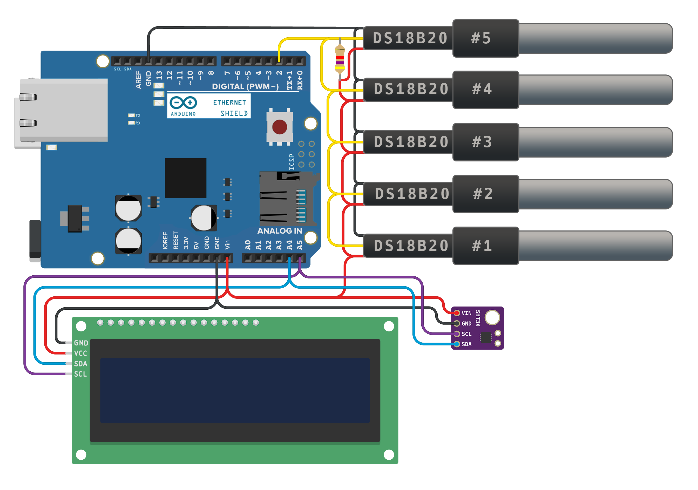

# What is this?
###### Server Room Monitoring - a device for monitoring the temperature and humidity of servers, server rooms and just for rooms where environmental control is needed.

------------

##### The differences between this system and Zabbuino in open source for the Arduino IDE. Anyone can customize the device to suit their needs. 
##### You can remove the display if display control is not needed, or change it to any other display by rewriting the code a bit. 
##### You can add or remove any sensor, for example, you can control the content of carbon dioxide or dust particles in the air, everything that you can implement on Arduino can be done here.

------------

# Electronic circuit:

# Components that I used:
###### Arduino UNO R3

###### Ethernet shield w5100

###### SHT31

###### DS18B20

###### LCD 1602 i2c

###### Resistor 4.7k

###### Box for mount din rail D6MG

###### RJ45 Cat5 Dual Port Surface Mount Box

