# What is this?
##### Server Room Monitoring - a device for monitoring the temperature and humidity of servers, server rooms and just for rooms where environmental control is needed.


------------
###### The differences between this system and Zabbuino in open source for the Arduino IDE. Anyone can customize the device to suit their needs. 
###### You can remove the display if display control is not needed, or change it to any other display by rewriting the code a bit. 
###### You can add or remove any sensor, for example, you can control the content of carbon dioxide or dust particles in the air, everything that you can implement on Arduino.
------------

<br>

# How its work?
##### Server Room Monitoring works as a passive zabbix agent. The Zabbix server polls the agent on a schedule, the agent generates data and sends it to the Zabbix server.


<br>


<p float="left">
  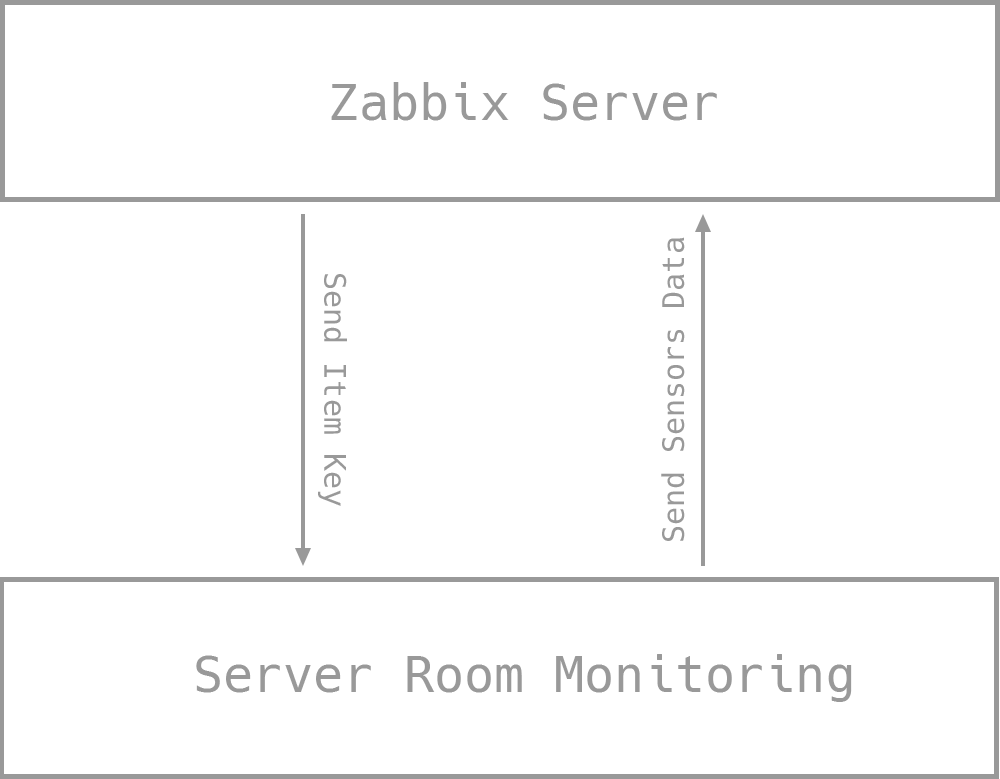 
</p>

<br>

# Electronic circuit:

<p float="left">
  
</p>

<br>

# Components that I used:

<details>
  <summary>ARDUINO UNO R3 - BASE</summary>
  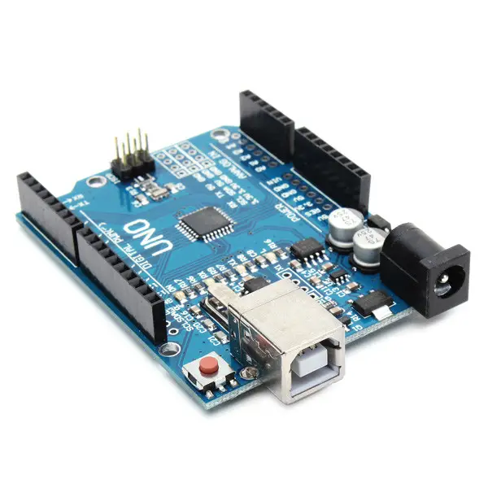
</details>

<details>
  <summary>ETHERNET SHIELD W5100 - EXTEND SHIELD FOR ARDUINO</summary>
  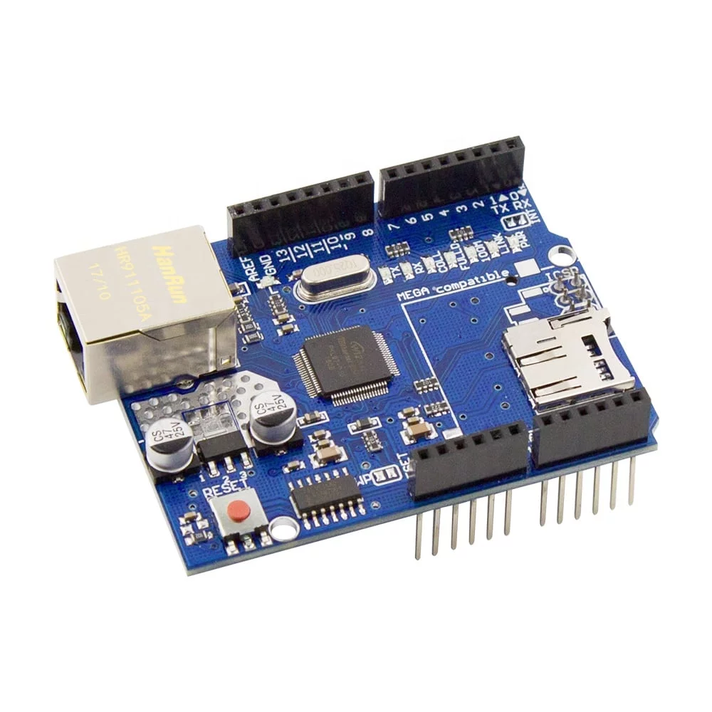
</details>

<details>
  <summary>SHT31 - TEMPERATURE AND HUMIDITY SENSOR</summary>
  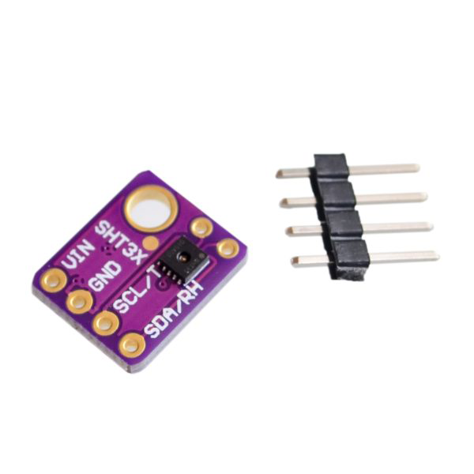
</details>

<details>
  <summary>DS18B20 - TEMPERATURE SENSOR</summary>
  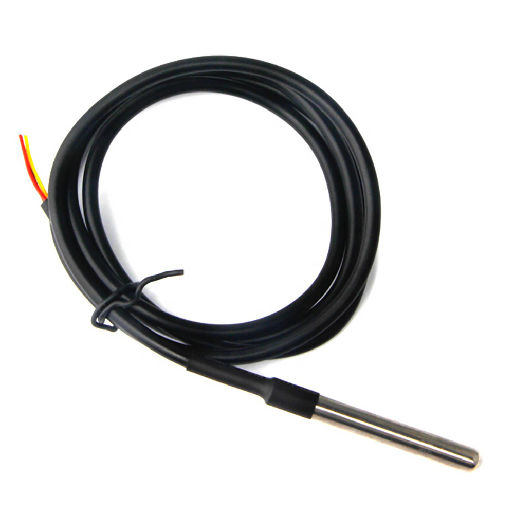
</details>

<details>
  <summary>LCD 1602 I2C - DISPLAY</summary>
  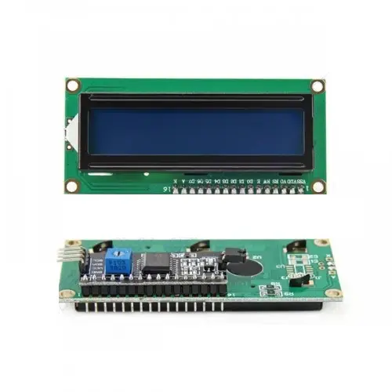
</details>

<details>
  <summary>RESISTOR 4.7K - PULL-UP RESISTOR</summary>
  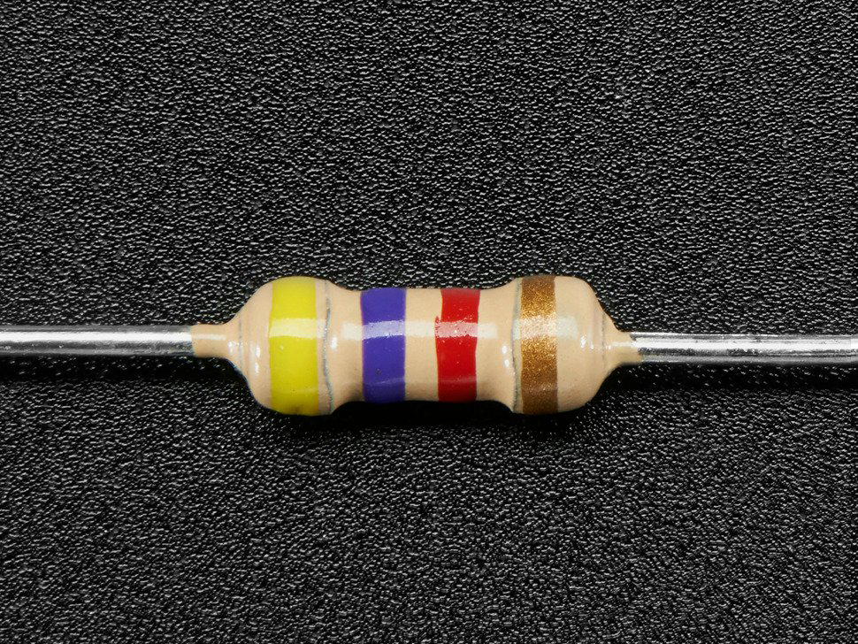
</details>

<details>
  <summary>D6MG DIN RAIL MOUNTING ENCLOSURE - BOX FOR ARDUINO</summary>
  
</details>

<details>
  <summary>RJ45 CAT5 DUAL PORT SURFACE MOUNT BOX - BOX FOR SENSORS</summary>
  
</details>

<details>
  <summary>RJ45 CAT5 SINGLE PORT SURFACE MOUNT BOX - BOX FOR CONNECTING SENSORS TO ARDUINO</summary>
  
</details>


<br>


# Libraries that I used:

- [SPI](https://www.arduino.cc/reference/en/language/functions/communication/spi/)
- [Ethernet](https://www.arduino.cc/reference/en/libraries/ethernet/)
- [OneWire](https://www.arduino.cc/reference/en/libraries/onewire/)
- [DallasTemperature](https://www.arduino.cc/reference/en/libraries/dallastemperature/)
- [LiquidCrystal_I2C](https://github.com/johnrickman/LiquidCrystal_I2C)
- [Wire](https://www.arduino.cc/reference/en/language/functions/communication/wire/)
- [SHT31](https://github.com/RobTillaart/Arduino/tree/master/libraries/SHT31)
- [GyverTimer](https://github.com/GyverLibs/GyverTimer)


<br>


# System Settings:
```cpp
#define LCD_ADDRESS 0x3F          // i2c LCD address
#define LCD_H 16                  // number of horizontal cells
#define LCD_V 2                   // number of vertical cells
#define SHT31_ADDRESS 0x44        // i2c address of SHT3X
#define ONE_WIRE_BUS 2            // Pin Onewire (DT18B20) bus
#define TEMPERATURE_PRECISION 10  // DT18B20 temperature conversion accuracy
#define MAX_COMMAND_LENGTH 32     // Maximum Zabbix command length
#define MEASUREMENTDELTA 10000    // Sensor polling interval
#define LCDINTERVAL 5000          // Display refresh interval
```


------------
###### You'll need a scanner i2c to find the display and sht31 addresses
------------

<br>

```cpp
// OneWire sensor address array(you need to change the address to yours)
DeviceAddress addrsensdt[] = {
  { 0x00, 0x00, 0x00, 0x00, 0x00, 0x00, 0x00, 0x00 },	  // Must be emty (0x00)
  { 0x28, 0x66, 0x66, 0x83, 0x18, 0x20, 0x01, 0x43 },	  // Address of the first sensor
  { 0x28, 0xC0, 0x69, 0x8C, 0x18, 0x20, 0x01, 0x58 },	  // Address of the second sensor
  { 0x28, 0x2C, 0xBA, 0xC3, 0x18, 0x20, 0x01, 0x66 },	  // Address of the third sensor
  { 0x28, 0x09, 0x0F, 0xA9, 0x18, 0x20, 0x01, 0x2D },	  // Address of the fourth sensor
  { 0x28, 0x7E, 0x30, 0x83, 0x18, 0x20, 0x01, 0xB0 },	  // Address of the fifth sensor
};
```


------------
###### You'll need scanner onewire to find ds18b20 addresses 
------------

<br>

# Zabbix Agent Settings:
```cpp
String ItemKey = "GetData"      //Item key of zabbix host
```
------------
###### Read more about item key [here](https://www.zabbix.com/documentation/current/en/manual/config/items/item)
------------

<br>

# Network Settings:
```cpp
byte mac[] = { 0x00, 0x00, 0x00, 0x00, 0x00, 0x00 };  // Important! Change MAC address!
                                                      // MAC address must be unique on your local network.
IPAddress ip(192, 168, 0, 100);                       // Change IP address if you need.
IPAddress gateway(192, 168, 0, 1);                    // Change GW if you need.
IPAddress subnet(255, 255, 255, 0);                   // Change MASK if you need.
EthernetServer server(10050);                         // Change port if you need.
```

<br>

# Zabbix Server Settings:
------------
###### This is an example setup, if you want to rename host or element, key etc differently you can do that.
------------

1) Create [host](https://www.zabbix.com/documentation/current/en/manual/config/hosts/host) with parameters:

  - Name: Server Room Monitoring
  - Interface: 
    - Type: Agent
    - IP: IP address Server Room Monitoring

2) Create [item](https://www.zabbix.com/documentation/current/en/manual/config/items/item) with parameters:

  - Name: "Data"
  - Type: "Zabbix agent"
  - Key: "GetData"
  - Type of information: "text"
  - Update interval: 10m

##### Ok, now you can turn on the device and get data from Server Room Monitoring. The data of all sensor will come in a text format with a "," delimiter.

------------
###### Example data string: 23,24,25,26,24,25,46.
###### The first parameter is the temperature with SHT31.
###### The second - the first DS18B20 and so on.
###### The last parameter is humidity from the SHT31 sensor.
###### Dependent item and regular expressions are used to separate the parameters and pass each parameter to an individual item.
------------

<br>

3) Create [dependents items](https://www.zabbix.com/documentation/current/en/manual/config/items/itemtypes/dependent_items) with parameters:

  - Item#1:
    - Name: 'Air humidity in server room'
    - Type: 'DEPENDENT'
    - Key: 'humidity'
    - Delay: '0'
    - Units: '%'
    - Description: 'Data from sensor SHT3X'

  - Preprocessing:
    - Type: REGEX
    - Parameters: '(\d+),(\d+),(\d+),(\d+),(\d+),(\d+),(\d+)' '\7'

<br>

  - Item#2:
    - Name: 'Air temperature in server room'
    - Type: 'DEPENDENT'
    - Key: 'temperature.0'
    - Delay: '0'
    - Units: 'C'
    - Description: 'Data from sensor SHT3X'

  - Preprocessing:
    - Type: REGEX
    - Parameters: '(\d+),(\d+),(\d+),(\d+),(\d+),(\d+),(\d+)' '\1'

<br>

  - Item#3:
    - Name: 'Air temperature in server room'
    - Type: 'DEPENDENT'
    - Key: 'temperature.1'
    - Delay: '0'
    - Units: 'C'
    - Description: 'Data from sensor DS18B20'

  - Preprocessing:
    - Type: REGEX
    - Parameters: '(\d+),(\d+),(\d+),(\d+),(\d+),(\d+),(\d+)' '\2'
  
##### And so on

------------
###### You can see [my template](https://github.com/disasstor/Server-Room-Monitoring/blob/2dcd5e67909eaa3db8a8260687d5095f5ebabb1c/Server%20Room%20Monitoring.yaml) to understand it.
------------

<br>

# Install components to sensor boxes
##### First step:
------------
###### We need to make wiring and install the sensor in the box, you need to make 5 pieces, these will be blanks.
------------
<p float="left">
  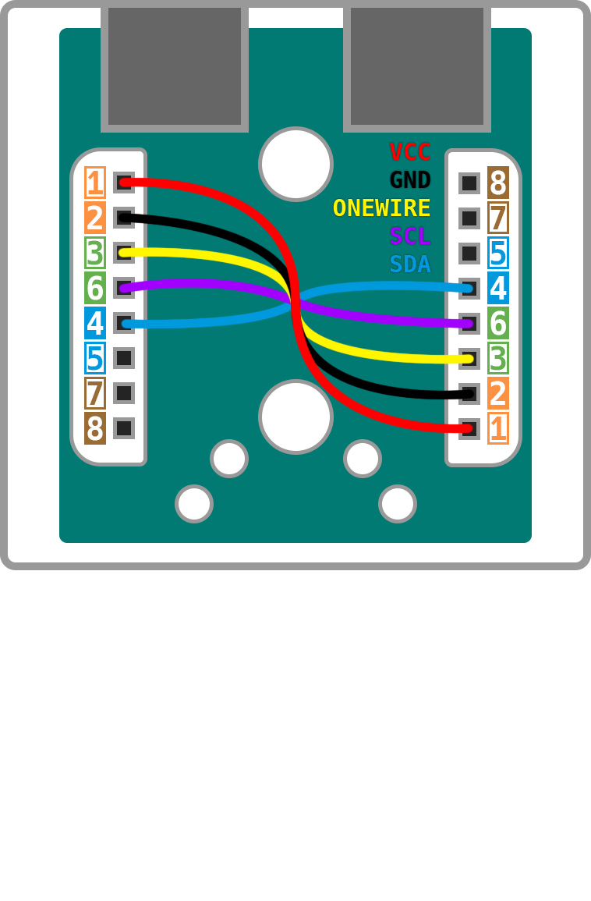
  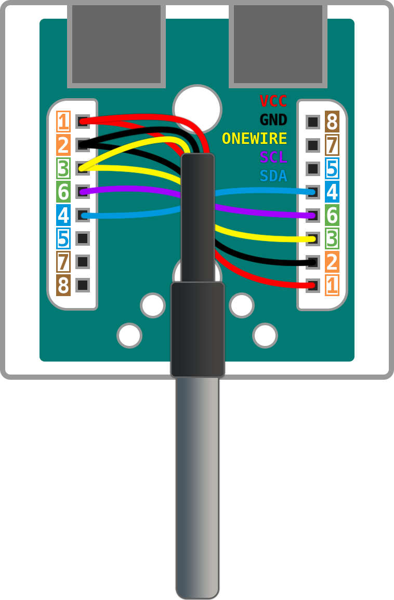 
</p>


##### Second step:
------------
###### Install SHT31 in first box
------------
<p float="left">
  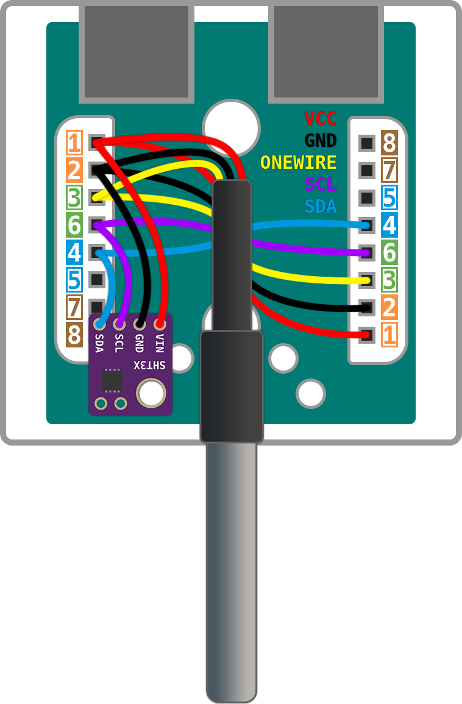
</p>


##### Third step:
------------
###### Install pull-up resistor in last box
------------
<p float="left">
  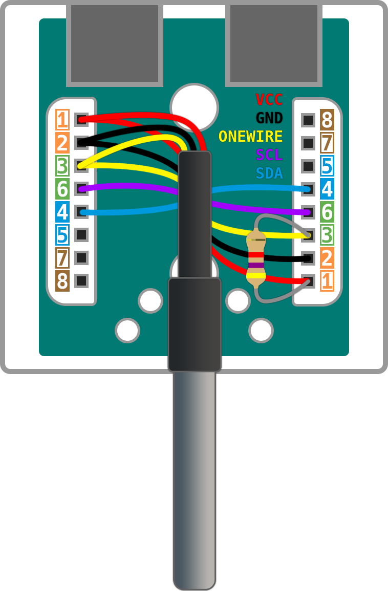
</p>


##### The result you should have is:
<p float="left">
  
</p>


